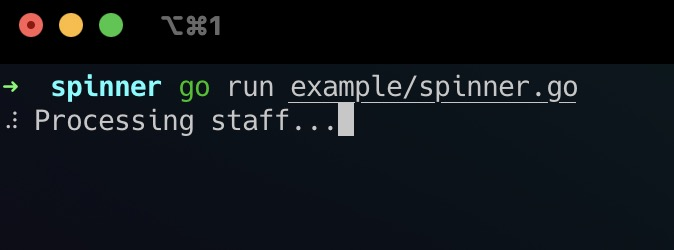

# Spinner

Opinionated terminal spinner.

[docs](https://pkg.go.dev/github.com/clmystes/spinner).

## Installation

```bash
$ go get github.com/clmystes/spinner
```

## Example

```go
s := spinner.New("Processing stuff...")
s.Start()
```

